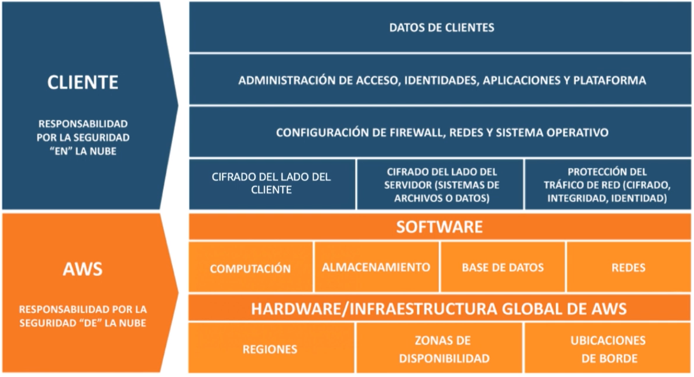

# ☁️ 01 - ¿Qué es el Cloud Computing?

## 📘 Introducción

El cloud computing (computación en la nube) es el suministro bajo demanda de recursos informáticos (como potencia de cálculo, almacenamiento, redes o aplicaciones) a través de Internet, con un modelo de pago por uso.

---

## 🧩 Modelo clásico de cliente-servidor

- **Servidor**: almacena y gestiona el contenido (CPU, RAM, almacenamiento, base de datos, red).
- **Cliente**: solicita datos al servidor a través de la red (usando su dirección IP).

**Dispositivos clave:**

| Dispositivo | Descripción |
|-------------|-------------|
| Router      | Reenvía paquetes de datos entre redes. |
| Switch      | Dirige paquetes dentro de una red local (LAN). |

---

## 🏢 Evolución de la infraestructura

Antiguamente, las empresas alojaban sus propios servidores físicamente (en casa, oficinas, etc), lo que implicaba:

- Costes elevados (alquiler, electricidad, hardware)
- Dificultad de escalado
- Necesidad de supervisión 24h
- Riesgos físicos (incendios, terremotos…)

---

## ☁️ ¿Qué es el Cloud Computing?

> Es el acceso bajo demanda a recursos tecnológicos, sin tener que gestionar físicamente servidores.

**Ventajas clave:**

- Rápido acceso a servidores, bases de datos y servicios
- Escalabilidad casi instantánea
- Solo pagas por lo que usas

---

## 🧱 Modelos de despliegue

| Modelo        | Descripción |
|---------------|-------------|
| Cloud privado | Uso exclusivo por una empresa (control total y seguridad). |
| Cloud público | Propiedad del proveedor (Amazon, Azure...), acceso por Internet. |
| Cloud híbrido | Combina servidores locales con servicios cloud. |

---

## ✨ Características del Cloud Computing

1. Autoservicio bajo demanda  
2. Acceso amplio a la red  
3. Alquiler múltiple y agrupación de recursos  
4. Escalabilidad y elasticidad rápida  
5. Servicio medido (pago por uso)  

---

## 🚀 Ventajas del Cloud Computing

- Sustituyes inversión (CAPEX) por gasto operativo (OPEX)  
- Te beneficias de economías de escala  
- No necesitas prever capacidad exacta  
- Rápida agilidad y despliegue  
- Sin costes de mantenimiento de centros de datos  
- Presencia global inmediata  

---

## 🧰 Tipos de servicios cloud

| Tipo   | Ejemplo               | Qué ofrece                                    |
|--------|------------------------|-----------------------------------------------|
| IaaS   | EC2                   | Infraestructura (servidores, redes...)        |
| PaaS   | Elastic Beanstalk     | Plataforma para desplegar aplicaciones        |
| SaaS   | Rekognition           | Software como servicio (sin gestionar nada)   |

---

## 🌍 Cómo elegir una región en AWS

- **Cumplimiento legal**: los datos no salen de la región sin permiso explícito  
- **Latencia baja**: elige la región más cercana a tus usuarios  
- **Disponibilidad de servicios**: algunos servicios nuevos solo están en regiones concretas  
- **Precio**: varía según la región  

🔗 [Ver servicios por región](https://aws.amazon.com/es/about-aws/global-infrastructure/regional-product-services/?p=ngi&loc=4)

---

## 🔐 Modelo de responsabilidad compartida

- **Cliente**: se encarga de la seguridad "en" la nube (datos, usuarios, firewalls…)
- **AWS**: se encarga de la seguridad "de" la nube (infraestructura, hardware, software base…)

---
